# Portfolio Site

## Purpose
The purpose of the website is to display a portfolio advertising personal skills and projects that would utilize my skills which would be displayed through-out the website. The portfolio contains an abouts page with information about me and my brief description on my skills and past projects. The portfolio page will display images cards with the titles of the projects I have completed. The blogs page displays five blogs with links to each blogs page. The contacts page will contain contact information and a form for visiters to fill out in order to contact me.

# Functionality / Features

## Colours 

- The colours that are used through-out the site where choosen to convey a calm, natural aesthetic. The colours don't overwhelm the viewer and work coherently together. The colours of the web-pages through-out the site change to portray to the viewer that they are on a different page, yet the colours are all familiar. This conveys that you are on the same site, but there is a visual difference to keep the viewer engaged. The four colours are the only ones beside the black text that are used to aid in achieving this. Utalizing neutral and natural colours for the site assists in the overall aesthetic.

- The colours that are used repeatedly thorugh-out the site has been complied into thier own '_color.scss' file under the defaults and styling page. This file has then been imported into each of the styling sheet to be used to organise the colours with thier own names.

- On some of the text through-out the site, if hovered over or clicked the colours will change to indicated what is a link and what has been visited.

## Header

- The header contains a bamboo home icon and an 'About', 'Projects', 'Blogs' and 'Contact' page. The header has a large border-radius that makes it smooth. This adds the the calm and natural aesthetic by avioding shape edges through-out the web-site. 

- Once a link has been visited it will also turn a different colour to aid the viewer in thier navigation of the website. These links will enlarge when hovered over too.

- The header contains a bamboo icon that leads back to the home page along with links to the 'About', 'Portfolio', 'Blogs' and 'Contact' page.

- Animations are used in the header. The size will gradually change when minimizing the screen. This is to make the transition between the sizes smoother. A transition time of 2 seconds was used to achieve this.

- When hovering over the links in the header it will enlarge. This is to emphasize that it is a link to another page. Since there is no underline under the links, the hover animation makes it clearer to the viewer. This is displayed on all pages of the web-site.

- Some pages on the site have different header background-colours. There are two main header colours used through-out the site. To organise these two seperate header components, two header scss files  where created to import to thier respective pages. 

## Footer: 
- The footer contains links to GitHub, LinkedIn and Instagram. 

- The footer is designed to be shorter than the header since there is less information to be displayed, this also helps break up the page and adding a sense of depth. 

- The colour of the footer depends on the back-ground color of the web page. Similar to the header, the footer has a large border-radius that makes it smooth. This adds the the calm and natural aesthetic by avioding shape edges through-out the web-site.

- Animations are used in the footer. The size will gradually change when minimizing the screen. This is to make the transition between the sizes smoother. A transition time of 2 seconds was used to achieve this.

- Some pages on the site have different footer background-colours. There are two main footer colours used through-out the site. To organise these two seperate footer components, two footer scss files  where created to import to thier respective pages. 

## Home Page:
- The Home page contains the footer and header along with my name and a breif description of what I do. These details are just below the header and are in bold, black writing. This is to make it clear what the site is about and gives the viewer a breif idea of what will be displayed on the portfolio and blogs pages. 

- The accompanying image relates back to the overall theme of nature and the green colours. 

## About Page:
- The About page contains an image of me, my name and breif description of my skills ect, which would be elaberated on in the portfolio page. Following along with the aesthetic of the website, all edges on this page are also curved. 

- A new feature introduced on this page is a shadow around the information and picture card which aids in adding depth. It also assists in the drawing the viewers eye to the information that I would want them to focus on. If viewers are following the links to the other pages in order, the 'About' page will start to show colour changes to the content from the 'Home' page in order to keep the viewer engaged. 

- A link to my resume is also clearly present at the end of the information so that viewers can easily have access to a full list of skill and experience that might not be fully shown or relevent to the information conveyed on the website. When hovered over, the resume link will also change colour to indicate that it may be clicked on.

- When rezising this page for tablet and mobile, the picture will be relocated to under the written information. This was done since the written information and displaying the resume would be more important for the viewer or respective employer to view and be able to access instead of having to scroll.

- For ther CSS on this page a div container with left-side and right-side divs was used to be able to effectively move the content with in the page around by dividing this content. 

```html
<section>
                <div class="container">
                    <div class="content">

                        <div class="left-side">
                            
                        </div>

                        <div class="right-side">
                            <div class="about-text">
                                <h2 class="name-title">Emily Mehegan</h1>
                                <h4 class="sub-heading">Designer & Developer</h4>
                                <p class="para-text">Hello! I'm a Front-End and Back-end Developer. Lorem ipsum dolor sit amet consectetur adipisicing elit. Suscipit accusantium explicabo consectetur eveniet repellat. Veritatis optio quo ipsam. Doloribus, nam dolor? Soluta fuga possimus corporis a enim quasi ipsum perspiciatis? Lorem ipsum dolor sit amet, consectetur adipisicing elit. Commodi earum labore maxime soluta cumque odio, inventore nam quisquam, obcaecati qui iste asperiores enim ad omnis mollitia, perspiciatis eos doloribus repellat?</p>
                            </div>

                            <div class="resume-div">
                                <a class="resume" href="../documents/resume.pdf">Resume</a>
                            </div>
                        </div>

                    </div>
                </div>
            </section>
```

- This page has it's own screen size styling to effectivly move and utilise the space at those sizes.

## Projects Page:
- The Projects page consists of four projects. An image and heading is used to display them. The background colour for this web-page is darker and was used to display the Project image/heading cards so they are more clearer on the screen. This also helps break up the web-site, but still bringing coherency by using the three main colours of the site. The header and footer where also changed to achieve this.

- Tablet and moblie view moves the project cards down until it is a list. This was a clear way to present them and an easy way for the viewer to navigate this page. This also displays them in a clear way no matter the size of the screen.

- Compared to the other pages, this one has its own seperate body styling compared to the rest of the site. 

## Blogs Page:
-  The blogs page is contructed similarly to the projects page. This adds familiarity with the website feature for the viewer. This also makes the site seem neater. 

- Each Blog information card has an image, heading, date, brief description and 'Read Me' link that goes to the blog page. Each image relates to the blog topic and contains the title and date to give viewers relevent information of the overall blog post. A description for each post is also included to provide further information. 

- Each blog card as a 'Read Me' link that goes to each of their blog pages.

- Similar to the 'Projects' page, tablet and moblie view moves the project cards down until it is a list. This was a clear way to present them and an easy way for the viewer to navigate this page. This also displays them in a clear way no matter the size of the screen.

## Blog Pages:

- The blog pages and the full blog posts that are presented on the 'Blogs' page. When clicking on the 'Read Me' link on the 'Blogs page they will lead to the blog that they have clicked on. 

- The blogs utalise a CSS Grid styling. This was the clearest way to display each blog post and provide a neat and aesthietically pleasing page for the viewer to read each blog. Each blog post has a clear title in the top middle of the page. Just before each blog post in the date. All information is clearly displayed on each of the pages.

```scss
main {
    display: grid;
    grid-template-columns: 1fr 5fr 1fr;
    grid-template-rows: 100px 50px 1fr;

    margin-bottom: 50px;

    .blog-heading {
        background-color: $primary-color;
        grid-column: 1 / -1;
        grid-row: 1 / 3;
        text-align: center;
        margin-top: 20px;
        font-size: 20px;
    }

    .date {
        background-color: $primary-background;
        padding: 20px;
        grid-column: 2 / 3;
        grid-row: 2 / -1;
    }
}
```

- The back-ground of the blog pages is different to each of the other website pages. Two background colours are used to achieve this by spliting the background colour into to seperate colours. For the background colour, sizes where changed in order to display the page properly across the three screen sizes. Three main colours where used to seperate part of the page to achieve an aethetically pleasing and neat blog page.


## Contacts Page:
- The contacts page contains a form that invites people to send a message. The page also contains contact information and a call to 'Get in Touch!'. This is presented in the draker green to draw attention of the text. Below is another message letting people know that they are able to contact me for anything professional or casual. This invites many people from a professional standpoint (employer), or even invite others who work in the industry to aid in networking with other developers and designers.

- The contacts card is clear and user friendly to make it easier for anyone to send a message or get in contact. The shadow around the card also makes it stand out and adds depth to the contact card.

- Along with the contact information are both phone and email icons to help break up and present the contact information in a neat and visually pleasing way.

- In tablet and mobile view the form is moved to the top of the page while the contact information is moved to the bottom of the page. It is presented this way since anyone who has an inquire would most likey just fill in the form since it would be easier with the form present. This also moves the call to action at the top of the page in these views. This also provides clarity on the purpose of this page. 

- When hovering over the send button it cursor will turn into a pointer to indicate that it is a button. 

- Contacts page has a container div with left-side and right-side div to help styling and separate the form and contact info.

```html
<div class="container">
                <div class="content">
                    <div class="left-side">

                        <div class="details">
                            <div class="topic-name">Emily Mehegan</div>
                        </div>

                        <div class="details">
                            <i class="fa-solid fa-phone"></i>
                            <div class="topic">Phone</div>
                            <div class="text-one">0404044040</div>
                        </div>

                        <div class="details">
                            <i class="fa-solid fa-envelope"></i>
                            <div class="topic">Email</div>
                            <div class="text-one">14220@coderacademy.edu.au</div>
                        </div>
                    </div>

<!--The right-side class contains the form that the viewer can fill out and send-->

                    <div class="right-side">
                            <div class="heading-text">Get in Touch!</div>
                            <div class="message">Send me a message for any enquires or questions. Happy to have a chat!</div>
                        
                        <form>
                            <div class="form-elements">
                                <label>Name: </label>
                                <input class="form-input" />
                            </div>
            
                            <div class="form-elements">
                                <label>Email: </label>
                                <input class="form-input" />
                            </div>
            
                            <div class="form-elements">
                                <label>Message: </label>
                                <textarea
                                    rows="3"
                                    class="form-input form-textarea"
                                >
                                </textarea>
                            </div>
            
                            <div class="btn-div">
                                <button id="send">Send</button>
                            </div>
                        </form>
                    </div>
                </div>
            </div>
```


<br>
<br>
<br>

# Sitemap
The following is the sitemap of the original layout of the website. 

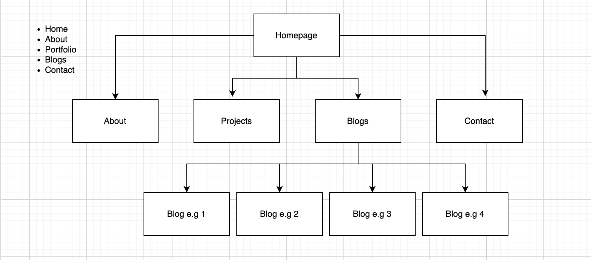

<br>
<br>

# Screenshots
 These are screenshots of the live site in desktop, tablet and moblie view.

 ## Home Page

 ### Desktop View
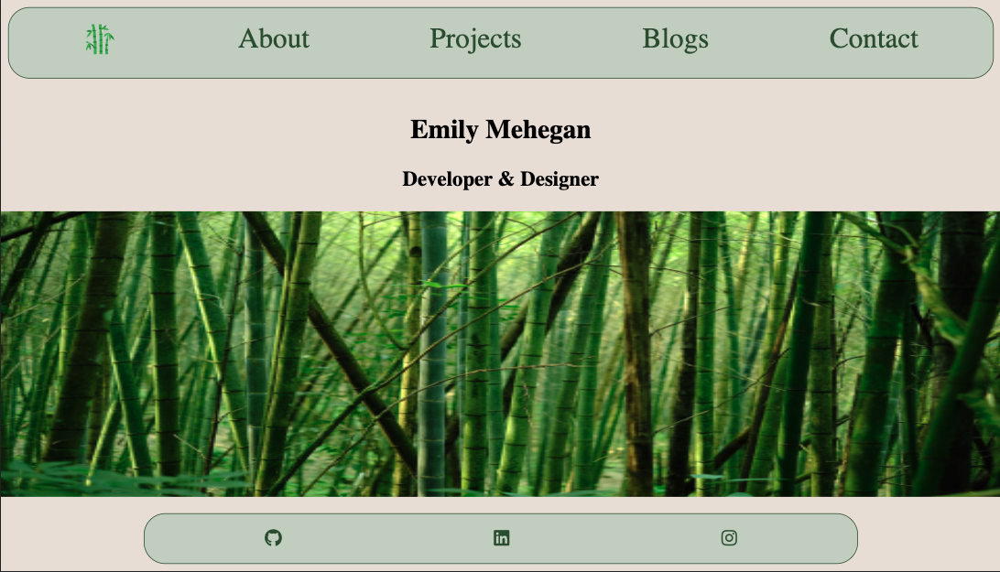

### Tablet View
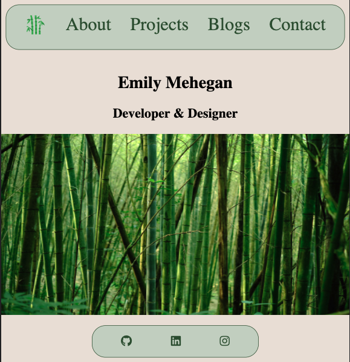

### Mobile View
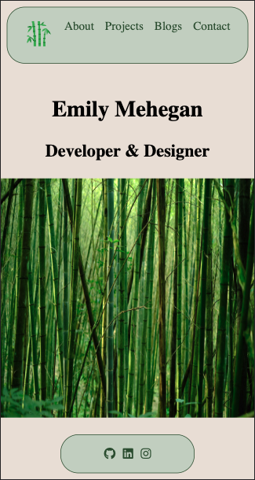

## About Page

### Desktop View
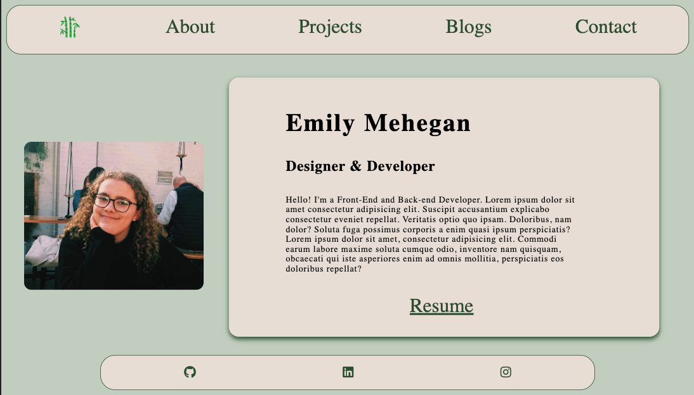

### Tablet View


### Mobile View
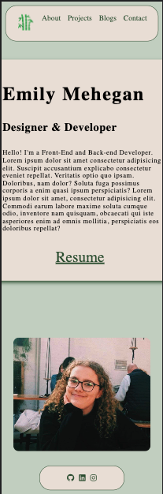

## Projects Page

 ### Desktop View


### Tablet View


### Mobile View
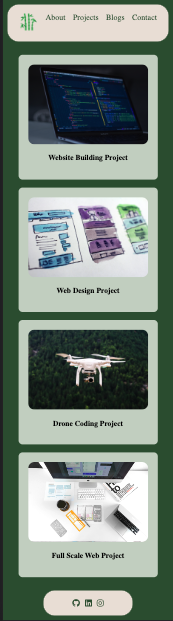

## Blogs Page

### Desktop View


### Tablet View
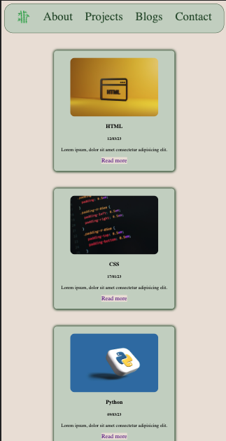

### Mobile View


## Blog Pages

### Desktop View
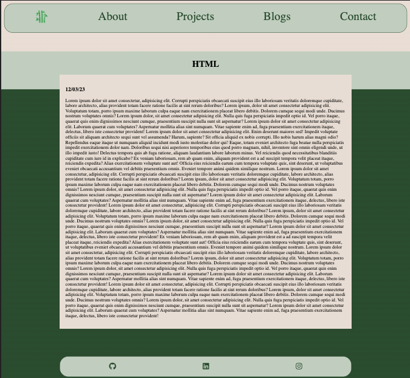

### Tablet View
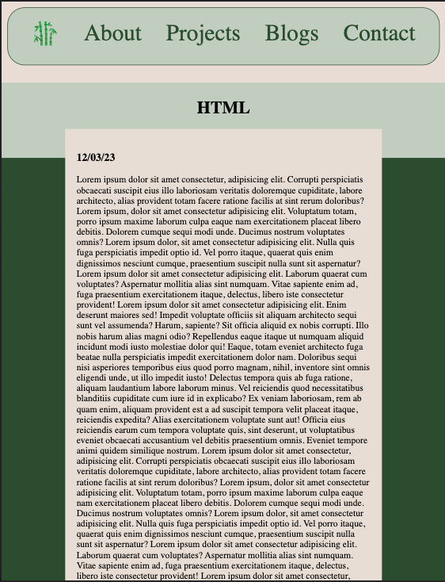

### Mobile View


## Contacts Page

### Desktop View


### Tablet View
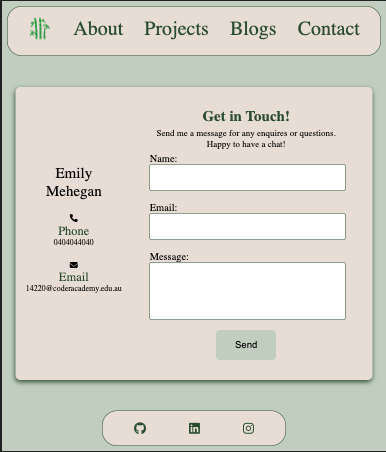

### Mobile View


## Target audience
The target audience for this portfolio is employers looking for a freelance front-end and back-end developer. It is also welcoming for people wanting to ask any questions and invites people who want to network with other developers and designers. This is emphasised through the form and text on the contact page.

## Tech stack

- HTML
- CSS
- SASS
- Netlify
- GitHub

<br>

# Links

## Portfolio Link
- https://emilymeheganportfolio.netlify.app

## GitHub Link
- https://github.com/e-mehegan/-EmilyMehegan-_T1A2.git

## Presentation Link
- https://vimeo.com/813800293